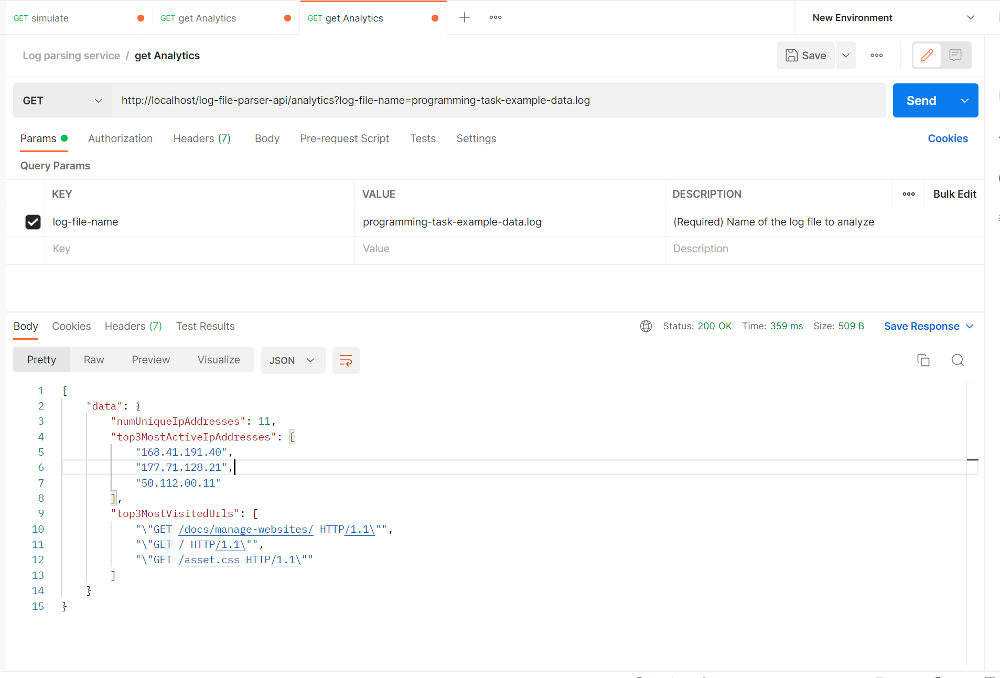

# log-file-parser-service
This is a dockerized Spring Boot microservice that I am happy to maintain.

# A GET api to get the log file analytics

## assumptions
1. ip addresses and urls appear once per line in the log file.
2. each log entry in the log file is line separated.
3. ip addresses and urls can appear anywhere in the log file.
4. the number of occurrence of url and ip address does not exceed `Long.MAX_VALUE`.
5. For same occurrences of url or ip address, order them by lexicographical ordering of the string url or ip address.
6. http method type in the url string is separated by a single space `GET /blabla`

### build requirements
1. JDK 17
2. Maven
3. Docker
4. docker-compose

## How to build and run the program
1. Run `./local-development/start.sh` to build the service according to `./api.json` and run it locally in a fairly simple docker container. 
   Dockerfile and docker-compose.xml can be found under `./local-development` folder
2. By running a test case within the `LogParsingControllerIT.java` we are running the simulation api with different input params.
3. To test the API and see API documentation, import the `api.json` under the root folder into postman.
   https://learning.postman.com/docs/designing-and-developing-your-api/importing-an-api/
   
4. Remote JVM debug port expose to `8000`
5. Unit tests post-fixed with `*Test.java`. Component tests post-fixed with `*IT.java` 
7. Note that logging is disabled for performance for tests.
8. Some test log files are stored under the `local-development/files` folder
